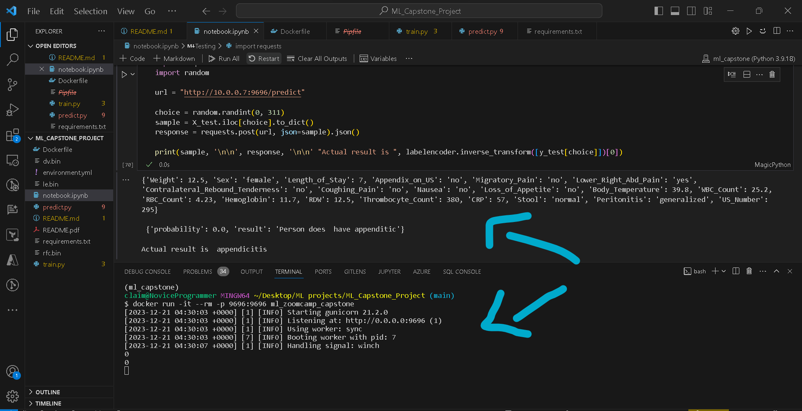

# Regensburg Pediatric Appendicitis Prediction

As part of the ML Zoomcamp by DataTalks, I worked on the Regensburg Pediatric Appendicitis dataset provided by the [UC Irvine Machine Learning Repository](https://archive.ics.uci.edu/dataset/938/regensburg+pediatric+appendicitis).  

This dataset holds the data from a cohort of pediatric patients with suspected appendicitis admitted with abdominal pain to Children’s Hospital St. Hedwig in Regensburg, Germany, between 2016 and 2021. Each patient has (potentially multiple) ultrasound (US) images, aka views, tabular data comprising laboratory, physical examination, scoring results and ultrasonographic findings extracted manually by the experts, and three target variables, namely, diagnosis, management and severity.  

This dataset was acquired in a retrospective study from a cohort of pediatric patients admitted with abdominal pain to Children’s Hospital St. Hedwig in Regensburg, Germany. Multiple abdominal B-mode ultrasound images were acquired for most patients, with the number of views varying from 1 to 15. The images depict various regions of interest, such as the abdomen’s right lower quadrant, appendix, intestines, lymph nodes and reproductive organs. Alongside multiple US images for each subject, the dataset includes information encompassing laboratory tests, physical examination results, clinical scores, such as Alvarado and pediatric appendicitis scores, and expert-produced ultrasonographic findings. Lastly, the subjects were labeled w.r.t. three target variables: diagnosis (appendicitis vs. no appendicitis), management (surgical vs. conservative) and severity (complicated vs. uncomplicated or no appendicitis).  

In the original problem, there were three target variables: Managment, Diagnosis and Severity. Management was multinomial variable and Severity described the severity of the appendicitis. Diagnosis is picked as the target variable for this capstone project. We use various Machine Learning algorithms to predict whether a patient has appendicitis or not.

## Instructions to test:  

1. __Dataset :__ For this notebook, you don't need to download data from anywhere. The repository has its own API which can be used to get the data simply by importing their module and using the appropriate ID.  
2. __Setting up env :__ To test before setting up a docker container, you can use the requirements.txt or environment.yml to install the necessary packages.  
 a. To use the requirements.txt, run the following command in the terminal:  
 ```shell
conda create --name ml_capstone python=3.9
pip install -r requirements.txt
```  
b. To use environment.yml, run the command  

    ```shell
    conda env create -f environment.yml
    ```  
This of course assumes you have conda installed.  

3. Activate the environment with `conda activate ml_capstone`.  

4. You can view the notebook to view all the EDA and data cleaning has been done to train the models. You can run before the last section to avoid any errors.  
5. Run the following command to build your docker container.  

```shell
docker build -t ml_zoomcamp_capstone .
```  
6. After the building is complete, you can run the docker container with the following command:  
```shell
docker run -it --rm -p 9696:9696 ml_zoomcamp_capstone
```  
7. While the docker container is running, you can try running the last 2 code blocks of the notebook. The code block will run different test sample to show diffferent results.  

Below image shows docker container running and we are using flask to use the locally deployed model for testing.


# Conclusion  

I really enjoyed participating in the ML Zoomcamp. If it weren't due to my health issues, I would have done better and maybe starter earlier. I really encourage everyone to go through notebook and feel free to provide feedback or suggestions to improve it. I encourage you to join the next cohort for purpose of learning.  